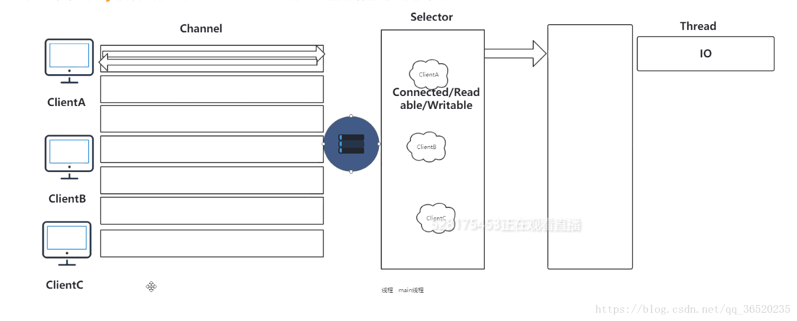

# Redis 缓存框架的基本介绍

Redis 是高性能的 key-value数据库，目前主流有Redis、memcache、Tair

Redis 官网：https://redis.io/

源码地址：https://github.com/redis/redis

Redis 在线测试：http://try.redis.io/

Redis 命令参考：http://doc.redisfans.com/

是一种内存数据库（nosql数据库）

关系数据库存放在硬盘中 查询实现io操作

非关系型数据库 Redis 持久化机制（防止断电没了） 淘汰策略（防止内存爆了）

## Redis应用场景

1. Token令牌的生成

2. 短信验证码的code

3. 可以实现缓存查询数据

   减轻我们数据库的访问压力。

4. Redis实现计数器

5. 分布式锁

6. 延迟操作

7. 分布式消息中间件

   

# Redis 简介

Redis（Remote Dictionary Server）是一个开源的内存数据库，遵守 BSD 协议，它提供了一个高性能的键值（key-value）存储系统，常用于缓存、消息队列、会话存储等应用场景。

- **性能极高：**Redis 以其极高的性能而著称，能够支持每秒数十万次的读写操作24。这使得Redis成为处理高并发请求的理想选择，尤其是在需要快速响应的场景中，如缓存、会话管理、排行榜等。
- **丰富的数据类型：**Redis 不仅支持基本的键值存储，还提供了丰富的数据类型，包括字符串、列表、集合、哈希表、有序集合等。这些数据类型为开发者提供了灵活的数据操作能力，使得Redis可以适应各种不同的应用场景。
- **原子性操作：**Redis 的所有操作都是原子性的，这意味着操作要么完全执行，要么完全不执行。这种特性对于确保数据的一致性和完整性至关重要，尤其是在高并发环境下处理事务时。
- **持久化：**Redis 支持数据的持久化，可以将内存中的数据保存到磁盘中，以便在系统重启后恢复数据。这为 Redis 提供了数据安全性，确保数据不会因为系统故障而丢失。
- **支持发布/订阅模式：**Redis 内置了发布/订阅模式（Pub/Sub），允许客户端之间通过消息传递进行通信。这使得 Redis 可以作为消息队列和实时数据传输的平台。
- **单线程模型：**尽管 Redis 是单线程的，但它通过高效的事件驱动模型来处理并发请求，确保了高性能和低延迟。单线程模型也简化了并发控制的复杂性。
- **主从复制：**Redis 支持主从复制，可以通过从节点来备份数据或分担读请求，提高数据的可用性和系统的伸缩性。
- **应用场景广泛：**Redis 被广泛应用于各种场景，包括但不限于缓存系统、会话存储、排行榜、实时分析、地理空间数据索引等。
- **社区支持：**Redis 拥有一个活跃的开发者社区，提供了大量的文档、教程和第三方库，这为开发者提供了强大的支持和丰富的资源。
- **跨平台兼容性：**Redis 可以在多种操作系统上运行，包括 Linux、macOS 和 Windows，这使得它能够在不同的技术栈中灵活部署。

------

## Redis 与其他 key-value 存储有什么不同？

Redis 与其他 key-value 存储系统的主要区别在于其提供了丰富的数据类型、高性能的读写能力、原子性操作、持久化机制、以及丰富的特性集。

以下是 Redis 的一些独特之处：

- **丰富的数据类型：**Redis 不仅仅支持简单的 key-value 类型的数据，还提供了 list、set、zset（有序集合）、hash 等数据结构的存储。这些数据类型可以更好地满足特定的业务需求，使得 Redis 可以用于更广泛的应用场景。
- **高性能的读写能力：**Redis 能读的速度是 110000次/s，写的速度是 81000次/s。这种高性能主要得益于 Redis 将数据存储在内存中，从而显著提高了数据的访问速度。
- **原子性操作：**Redis 的所有操作都是原子性的，这意味着操作要么完全执行，要么完全不执行。这种特性对于确保数据的一致性和完整性非常重要。
- **持久化机制：**Redis 支持数据的持久化，可以将内存中的数据保存在磁盘中，以便在系统重启后能够再次加载使用。这为 Redis 提供了数据安全性，确保数据不会因为系统故障而丢失。
- **丰富的特性集：**Redis 还支持 publish/subscribe（发布/订阅）模式、通知、key 过期等高级特性。这些特性使得 Redis 可以用于消息队列、实时数据分析等复杂的应用场景。
- **主从复制和高可用性：**Redis 支持 master-slave 模式的数据备份，提供了数据的备份和主从复制功能，增强了数据的可用性和容错性。
- **支持 Lua 脚本：**Redis 支持使用 Lua 脚本来编写复杂的操作，这些脚本可以在服务器端执行，提供了更多的灵活性和强大的功能。
- **单线程模型：**尽管 Redis 是单线程的，但它通过高效的事件驱动模型来处理并发请求，确保了高性能和低延迟。

## Redis 单线线程模型

Redis 底层采用Nio中的多路IO复用的机制，能够非常好的支持这样的并发，从而保证线程安全问题

Redis单线程，也就是磁层采用一个线程维护多个不同客户端的IO操作

但是Nio在不同的操作系统上实现方法不同，Windows上面使用的是select实现轮训的时间复杂度为O(n),而且存在空轮训的情况，效率非常低，其次是默认对我们的轮训的数据有一定的限制，所以支持上万tcp连接非常困难。

在linux操作系统中使用epoll实现时间驱动回调，不会存在空轮训的情况，只对活跃的socket连接实现主动回调，这样在性能上大大提升，时间复杂度为O(1)

注意：Windows操作系统没有epoll，只有linux有epoll

Redis线程模型

Redis采用Nio的 io 多路复用原则，也就是一个线程维护多个不同的redis客户端链接，从而提高处理效率和保证线程安全问题，底层使用linux操作系统的epoll技术避免空轮训。

